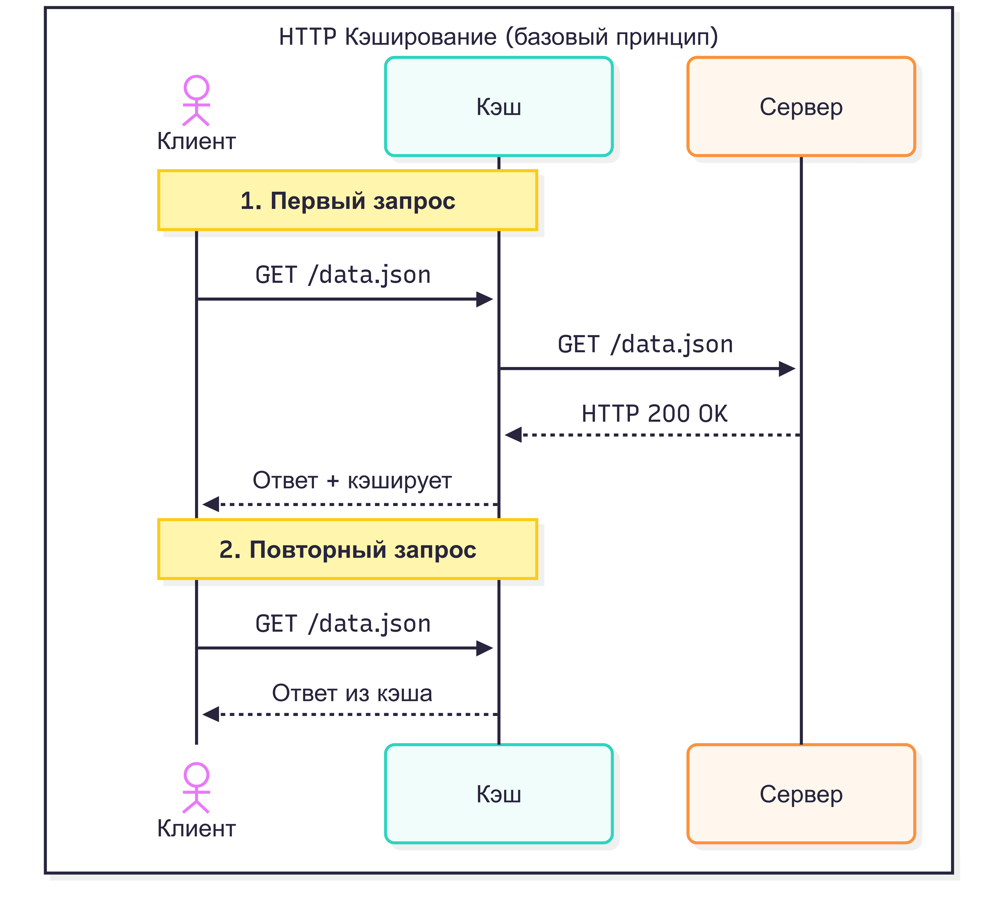
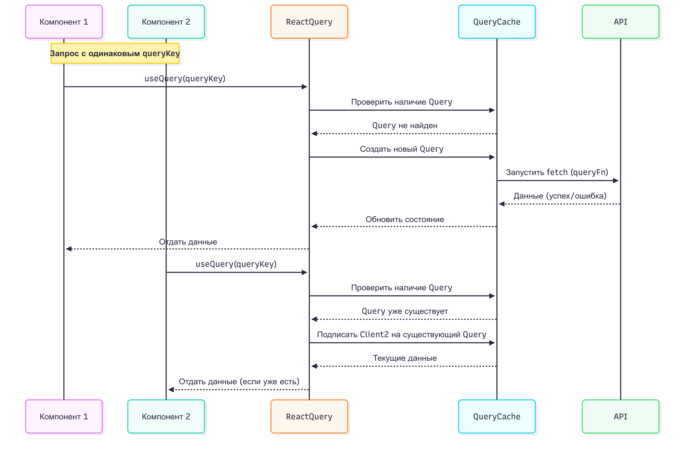

# Схемы доклада

## [Презентация](https://docs.google.com/presentation/d/1mwUaHKpID5DJhvj4rqFkPsXDOkP6Z-rq_kUl-H6fY-w/edit?usp=sharing)

## http cache

## Vary для локализации контента

## Vary для контентной адаптации

## Vary user agent

## Private cache

## Shared cache

## Last-modified

## Etag

## Etag

## Валидация

## no-cache

## must-revalidate

## no-store

## Длинные TTL и hash 

## Cхема кеширование персонализированного контента

## Service workers

## Бесконечный цикл 304

## SW проблемы с Vary

## Дедуплекация запросов

## Stale-while-revalidate Tanstack-Query

## Оптимистичные обновления

## Метрики

